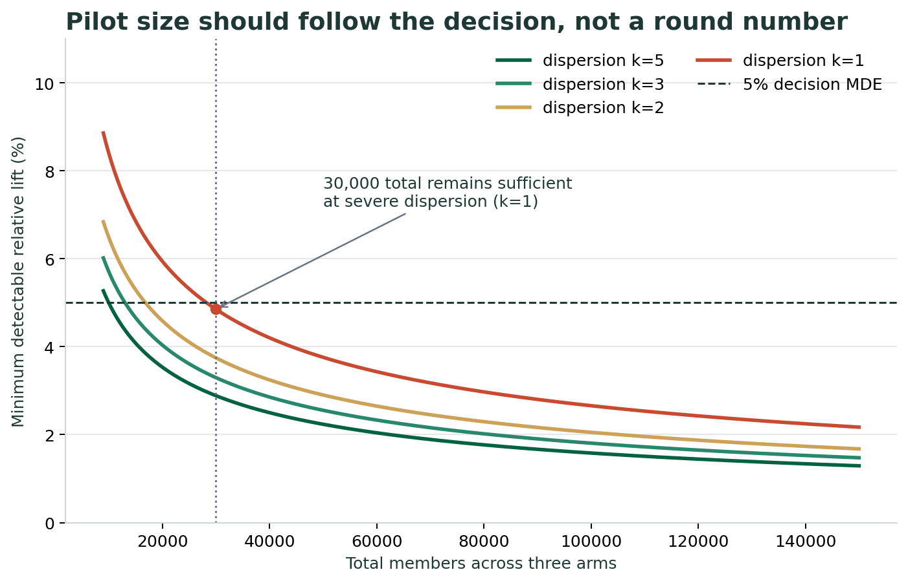
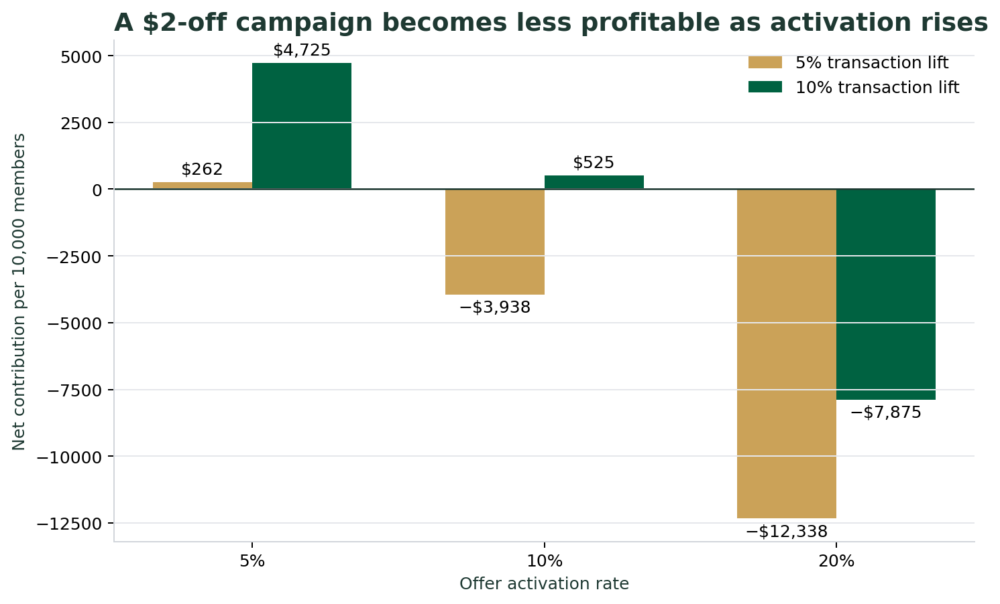
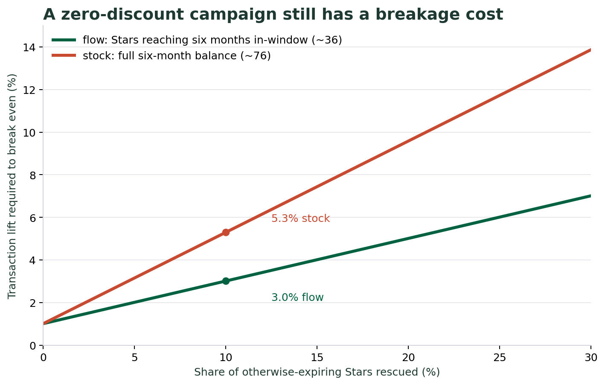
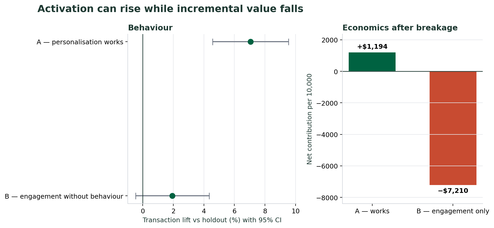
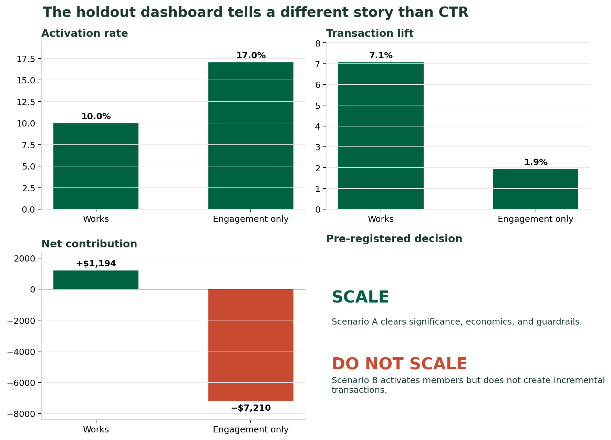

# The Stars They Already Earned

[](https://github.com/phay2712-web/starbucks-rewards-incrementality/actions/workflows/ci.yml)

**Growing profitable frequency among low-frequency Starbucks Rewards members — without a discount.**

An independent marketing analytics and strategy case study · August 2026

> Based entirely on public information and simulated data. Not affiliated with, endorsed by, or reviewed by Starbucks Corporation. No figure in this repository is Starbucks performance data.

---

## The short version

On **10 March 2026** Starbucks relaunched Rewards with three tiers. Buried in the program terms is a mechanic that applies **only to the entry tier**:

> Green members' Stars expire six months after the month they were earned — but can be extended by one month, **indefinitely**, with a single qualifying purchase, redemption, or $30+ digital reload. Gold and Reserve Stars never expire.

Compared against Dunkin', McDonald's, Dutch Bros and Panera, that is the **only conditionally renewable expiry rule in the category** — functionally the most forgiving policy any of them offers. It is also invisible unless you read the terms, which is exactly what the lowest-frequency members are least likely to do.

**Best-in-category benefit. Hypothesised worst-in-category awareness.** That gap is the campaign.

So the proposal is not another offer. It is a personalised reminder that costs nothing to give:

> *You have 85 Stars. They start expiring on 31 March. That's your usual Grande Vanilla Latte, on us. Any visit this month keeps them.*

This repository contains the measurement design and the economics that decide whether that is worth doing.

---

## What this repo actually demonstrates

| | |
|---|---|
| **Experiment design** | Three-arm test with a true holdout, identical zero incentive in every arm, so the only variable is how the message is selected |
| **Power analysis** | Sample size derived for an over-dispersed count outcome, Bonferroni-corrected — which cut the proposed pilot from 100,000 members to 30,000 |
| **Unit economics** | The real cost of a zero-discount loyalty campaign is *breakage*, not offer spend |
| **Decision rules** | Pre-registered thresholds that convert a result into scale / iterate / stop, applied mechanically |
| **Failure-mode detection** | A simulated scenario where activation hits 17% and the campaign still destroys value |

---

## 1. The business question

Growth and the relaunch occupy the same window. U.S. comparable store sales rose **7.9%** in Q3 FY2026, driven by a **4.2%** rise in transactions — the fourth consecutive quarter of comp growth. Menu, pricing, throughput, seasonality and the loyalty change all moved together.

Without a holdout, none of that lift can be attributed to the program. And an attribution error does not stay small; it compounds every time the company scales what it believes worked.

> **Five months after the Rewards relaunch, how much of the change in low-frequency Green member behaviour is genuinely incremental — and can it be grown profitably without further discounting?**

**Target segment.** Green tier, 1–2 qualifying purchases in the previous 30 days, **90+ days since enrolment** (Green is the automatic default tier, so it contains brand-new joiners whose behaviour has not stabilised), **not downgraded from Gold or Reserve** in the qualification period (a lapsed high-frequency member is a different psychology, and mixing the two manufactures noise), and holding 25+ Stars with an expiry date inside the pilot window.

---

## 2. Sample size was calculated, not asserted



The outcome is transactions per member over 12 weeks — a count, and an over-dispersed one. Treating it as normal with Poisson variance understates the sample required, so variance is modelled as negative binomial (`Var = μ + μ²/k`). Dispersion `k` cannot be known without internal data, so every result is reported across `k = 1…5`. Two primary comparisons are planned (C vs A, C vs B), so α is Bonferroni-corrected to 0.025.

| dispersion k | SD | n per arm for a 5% MDE | total, 3 arms |
|---|---|---|---|
| 5 (mild) | 2.78 | 3,332 | 9,996 |
| 3 | 3.17 | 4,346 | 13,038 |
| 2 | 3.61 | 5,613 | 16,839 |
| **1 (severe)** | **4.67** | **9,415** | **28,245** |

**10,000 per arm — 30,000 total — is sufficient even at the most severe dispersion tested.**

The original plan called for 100,000, which would detect a 2.7% lift: roughly **three times more power than the decision needs**. Surplus power is not free — every extra member sitting in a holdout is forgone revenue. Running the calculation made the test **70% cheaper** and made the holdout defensible to whoever has to approve it.

```
python analysis/power.py
```

---

## 3. Why not simply discount



| activation | net at 5% lift | net at 10% lift |
|---|---|---|
| 5% | +$262 | +$4,725 |
| 10% | **−$3,937** | +$525 |
| 20% | **−$12,337** | **−$7,875** |

*Per 10,000 members over 12 weeks. `CASE_ASSUMPTION`: $8.50 ticket, 25% contribution margin, $2.00 offer.*

A discount campaign is profitable only when **few people use it**. The marketing definition of success — high activation — is the financial definition of failure.

That is the argument for a mechanic with no incremental incentive at all.

---

## 4. The cost that is not on the marketing budget



A zero-discount campaign looks free. It is not.

Under standard loyalty accounting, unredeemed Stars sit as deferred revenue and are recognised as revenue when they expire — **breakage**. A campaign that stops Stars from expiring converts recognised revenue back into an obligation to serve.

```
net = incremental transactions × contribution margin per transaction
      − reduction in breakage revenue
      − messaging cost
```

How many Stars are actually exposed during a 12-week window is itself uncertain, so it is parameterised rather than assumed: `flow` counts only Stars reaching their six-month mark inside the window (~36), `stock` conservatively treats the whole six-month balance as exposed (~76).

| breakage rescued | breakeven lift (`flow`) | breakeven lift (`stock`) |
|---|---|---|
| 0% | 1.01% | 1.01% |
| 10% | 3.01% | **5.29%** |
| 20% | 5.01% | 9.58% |
| 30% | 7.01% | 13.87% |

Under the conservative pool, a campaign that rescues one in ten otherwise-expiring Stars needs roughly a **5% lift** to break even.

**That is why the target is ≈5% under the conservative `stock` assumption.** It is not a round number chosen for a slide.

```
python analysis/economics.py
```

---

## 5. The experiment

| Arm | Experience | Isolates |
|---|---|---|
| **A — Holdout** | No campaign message | Natural purchasing behaviour |
| **B — Generic control** | Non-personalised expiry reminder, $0 incentive | The effect of the *information* |
| **C — Treatment** | Personalised expiry reminder, $0 incentive | The *additional* effect of personalisation |

Every arm receives the same incentive: **nothing**. Same channel, same send time, same CTA, copy length within ±10%. The only variable is how the content is selected.

User-level randomisation with persistent assignment; no member appears in another overlapping test; intention-to-treat analysis; subgroups pre-registered and limited to two (baseline frequency tercile, channel).

**Seasonality.** The window overlaps the autumn seasonal launch. All three arms remain eligible for seasonal promotions — only the campaign message differs. Results are reported weekly so a promotional spike shows up as a visible peak rather than dissolving into an average.

**Holdout ethics.** Holdout members keep every published Green-tier benefit. They are excluded from *this campaign message*, not from the personalised offers the program promises.

---

## 6. Simulated results — including the failure mode



Two scenarios are simulated from known parameters. The second is the one worth reading, because a framework that only demonstrates its own success is a brochure.

**Scenario A — personalisation works.** Personalised arm lifts transactions 7.1% (95% CI 4.6–9.5%, p < 0.001), clearing the 5.7% breakeven. Net contribution **+$1,194** per 10,000 members. → **SCALE**

**Scenario B — engagement without behaviour.** Activation reaches **17%** — a number that would headline any engagement dashboard as a triumph. Transactions move 1.9% and the confidence interval crosses zero. Once lost breakage is charged, net contribution is **−$7,210**. → **DO NOT SCALE**

> The decision rule catches scenario B. A click-through dashboard would have called it a win.

That gap is the entire argument for holdout-based measurement, and it is why the primary metric is incremental contribution margin rather than any engagement metric.



```
python analysis/simulate.py
```

---

## 7. Decision rules

Written before the data, applied mechanically after it.

| Result | Reading | Decision |
|---|---|---|
| C > B > A, margin positive after breakage, guardrails hold | Personal relevance creates incremental behaviour | **Scale** to similar cohorts, keep a permanent holdout |
| C > B but neither beats A | Message attracts attention without changing behaviour | **Do not scale on engagement metrics.** Test occasion and access instead |
| Transactions rise, margin negative after breakage | Buying transactions with breakage revenue | **Iterate** — narrow to members with low-value expiring balances |
| Opt-out or complaints breach threshold | The campaign is eroding trust | **Stop**, regardless of revenue |

**Guardrails:** contribution margin per transaction within −2% · opt-out below 5% · privacy complaints below 0.5% · one reminder per expiry cycle · redemption-timing shift monitored as an early warning for "shifted, not incremental".

---

## 8. What I would ask Starbucks for

The most load-bearing unknown in this entire model is the historical breakage rate by frequency decile. Everything else is secondary.

1. Member-level transaction history and Star balances with expiry dates
2. **Historical breakage rate by frequency decile**
3. Product-level variable margin and true incentive cost
4. Offer exposure and activation events at member level
5. Assignment records for experiments already running, to avoid contamination
6. Opt-out and complaint data by campaign
7. The March 2026 tier-assignment thresholds — status was assigned from 2025 behaviour, so a discontinuity exists that could be analysed without running any test at all

---

## Repository layout

```
├── analysis/
│   ├── assumptions.py    single source of truth; every value carries an evidence label
│   ├── power.py          sample size and MDE for an over-dispersed count outcome
│   ├── economics.py      breakeven, breakage model, discount comparison
│   ├── simulate.py       three-arm simulation and the decision machinery
│   └── figures.py        every chart in this README
├── notebooks/
│   └── 01_experiment_design.ipynb    the full walkthrough, executed
├── data/                 simulated member-level outcomes and results (generated)
├── figures/              generated charts
├── docs/                 GitHub Pages site
├── deck/                 the presentation build plan
├── scripts/              deterministic notebook execution
└── tests/                analytical and repository integrity checks
```

## Reproducing

```bash
git clone https://github.com/phay2712-web/starbucks-rewards-incrementality.git
cd starbucks-rewards-incrementality
pip install -r requirements.txt
make all           # or: python analysis/{power,economics,simulate,figures}.py
```

Simulations are seeded (`seed=20260310`, the program relaunch date), summaries are recomputed from the generated member-level records, and every number in this README reproduces exactly.

---

## Evidence labels

Every value in `analysis/assumptions.py` carries one of four labels, and no figure is quoted without it:

| Label | Meaning |
|---|---|
| `PUBLIC_FACT` | Published by Starbucks or a regulatory filing. Sourced and dated. |
| `CASE_ASSUMPTION` | Chosen by the analyst. Not observed. Sensitivity-tested. |
| `PROPOSED_TARGET` | A threshold this case proposes, not one Starbucks set. |
| `CALCULATED` | Derived from the above. |

**Public facts, verified 11 August 2026**

| Fact | Value | Source |
|---|---|---|
| 90-day active U.S. Rewards members | 35.5M (Q1 FY2026, all-time high; 34.6M a year earlier) | [Q1 FY2026 disclosure](https://investor.starbucks.com/news/financial-releases/news-details/2026/Starbucks-Unveils-Reimagined-Loyalty-Program-to-Deliver-More-Meaningful-Value-Personalization-and-Engagement-for-Members/default.aspx) |
| Rewards share of U.S. company-operated revenue | Nearly 60% in FY2025 | [Starbucks Investor Day release](https://investor.starbucks.com/news/financial-releases/news-details/2026/Starbucks-Is-Back-Turning-Momentum-Into-Long-Term-Sustainable-Growth/default.aspx) |
| Program relaunch | 10 March 2026, Green / Gold / Reserve | [Starbucks press release](https://about.starbucks.com/press/2026/starbucks-unveils-reimagined-loyalty-program-to-deliver-more-meaningful-value-personalization-and-engagement-to-members/) |
| Green Star expiry and extension rule | 6 months, extendable by 1 month indefinitely via purchase, redemption or $30+ reload | [Starbucks Rewards FAQ](https://about.starbucks.com/starbucks-rewards-faq/) |
| U.S. comps Q3 FY2026 (quarter ended 28 Jun 2026) | +7.9%, transactions +4.2%, ticket +3.6% | [Q3 FY2026 results](https://investor.starbucks.com/news/financial-releases/news-details/2026/Starbucks-Reports-Q3-Fiscal-Year-2026-Results/default.aspx) |
| Rewards member count in the Q3 FY2026 release | Not disclosed — the 35.5M figure is six months old | [Q3 FY2026 results](https://investor.starbucks.com/news/financial-releases/news-details/2026/Starbucks-Reports-Q3-Fiscal-Year-2026-Results/default.aspx) |

**Known limitations.** No internal tier distribution, member-level history, offer exposure, or margin data. No knowledge of which experiments or models Starbucks runs internally — the gaps identified here are *public evidence gaps*, not claims about internal capability. The breakage treatment follows standard loyalty accounting; Starbucks' specific revenue-recognition policy should be confirmed in the 10-K before this analysis is presented as more than a model.

---

## License

MIT — see [LICENSE](LICENSE).

Starbucks, Starbucks Rewards, and related marks are trademarks of Starbucks Corporation, used here for identification only in an unaffiliated academic case study.
